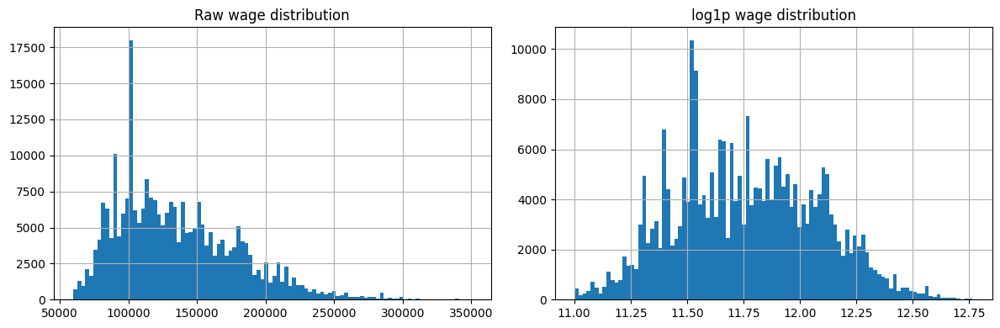
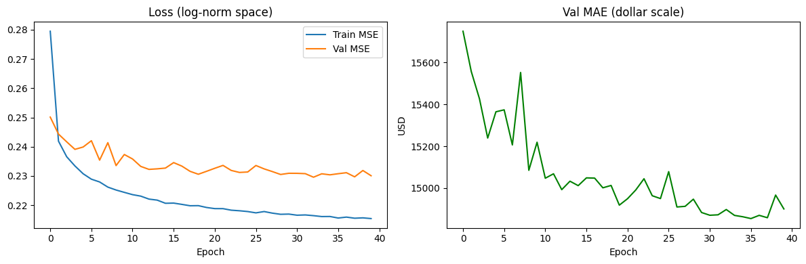
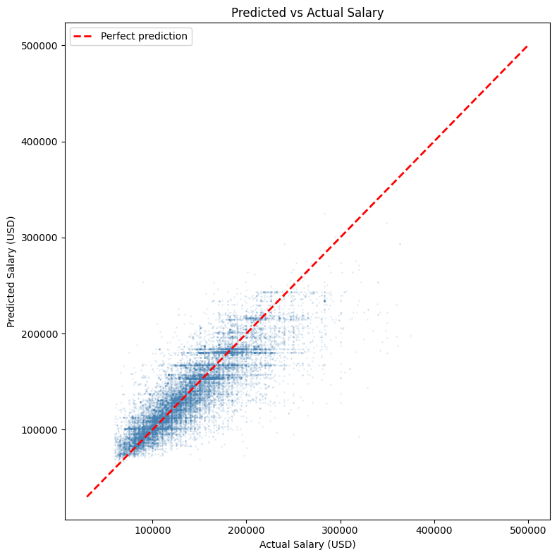
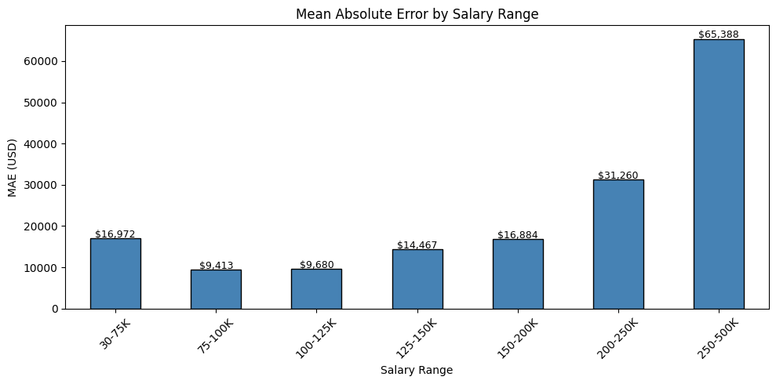

# Compensation Buddy
Compensation Buddy is an MLP model can help you figure out your salary based on role, location, and company type.

## What it does
Based on the user parameters below, it gives you a predicted annual salary
- Role Category
- Seniority Level
- Wage Level
- Metro Tier
- Industry
- Work State

## Tech Stack

| Category | Technology |
|---|---|
| Model | PyTorch (MLP with LayerNorm + GELU) |
| Data Processing | Pandas, NumPy |
| App | Streamlit |
| Dataset | US DOL H1B LCA Disclosure Data |
| Language | Python 3 |

## Dataset
- Source: US Department of Labor H1B LCA Disclosure Data
- Size: 259,936 certified tech records
- Target variable: Annual wage (USD)

# Implementation
## Data Pre-Processing
### Data Cleaning
- WAGE_UNIT_OF_PAY: convert into annual wages
- OUTLIER_FILTER: keep only range 50000-400000
- Normalize using log1p for bell-shaped, symmetric data



### Data Preprocessing
- Categorize JOB_TITLE into role_category
- Categorize EMPLOYER_NAME into is_top_tier, industry
- Add new field seniority based on JOB_TITLE
- Categorize WORKERSITE_CITY into metro_tier
- One-Hot Encode the categorical columns


## Model Training

- Final val MAE: ~$14,900
- Final val RMSE: ~$22,400
- Epochs to convergence: ~20
- Dataset size: 259,936 records
- Features: 82 (after One-Hot Encoding)

Training Plot



## Model Evaluation

### Predicted Salary vs Actual Salary



The model is pulling towards the mean because it has not captured enough variance in the high salary range. It could be because we the dataset don't have the years of experience field.

### MAE by Salary Range



This plot also shows that the model underestimates high-earners because of the missing experience parameter

## Model Performance
- MAE: $14,897
- RMSE: $22,352
- Best accuracy range: $75K–$200K salaries

## Limitations
- Dataset lacks years of experience which is the single strongest predictor of compensation
- Model underestimates high earners (>$200K) due to high variance in that range
- The model was trained only based on H1B filings hence it does not reflect the full market

## How to Run
```
git clone https://github.com/jean-johnson-zwix/compensation_buddy.git
cd src
pip install -r requirements.txt
streamlit run app.py
```